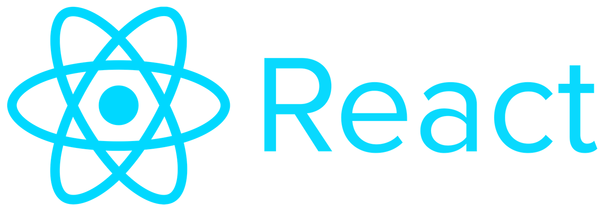

# 1. 핸즈온 소개

이 실습은 AWS Amplify를 사용하여 React로 작성된 웹 프론트엔드 앱과 GraphQL API 서버를 배포하는 과정을 다룹니다. AWS Amplify를 사용하면 웹 서비스에 필요한 다양한 구성 요소들을 편리하게 배포할 수 있습니다. AWS Amplify는 내부적으로 AWS S3, AWS AppSync 등의 AWS 서비스들을 사용합니다.

이 실습은 다음과 같은 순서로 진행됩니다.

1. 프론트엔드에서 사용할 GraphQL 스키마를 정의합니다.
2. 정의한 스키마를 기반으로 GraphQL API 서비스를 AWS 상에 배포합니다. (Amplify 사용)
3. 배포된 GraphQL API를 React 앱에서 사용할 수 있도록 연동합니다.

## 실습 목표
- GraphQL Schema의 구조를 이해하고 서비스 로직에서 필요한 데이터 스키마를 작성할 수 있다.
- AWS Amplify를 사용하여 GraphQL API를 배포한다.
- AWS AppSync Console의 구성을 이해한다.

## 실습에서 사용되는 주요 기술 및 AWS 리소스

### [React](https://ko.react.org)

이번 실습에서 사용할 Frontend UI는 React로 작성되어있습니다. 간단한 [할일 관리 어플리케이션(이하 TodoList)](https://github.com/cadenzah/todolist-react)을 사용합니다. 이미 완성된 코드를 사용하므로, React를 잘 모르시거나 익숙하시지 않더라도 괜찮습니다.

- [React 공식 문서](https://ko.react.org)

### [GraphQL](https://graphql-kr.github.io)

GraphQL은 API를 사용하기 위한 쿼리 언어입니다. 이번 실습에서는 일반적으로 사용되는 REST API가 아니라 GraphQL의 방식을 사용하여 데이터를 다룹니다. GraphQL에 대한 일반적인 내용은 아래 문서들에서 자세히 알아볼 수 있습니다.

- [GraphQL 공식 문서](https://graphql-kr.github.io)
- [How to GraphQL](https://velog.io/@cadenzah/graphql-01-introduction)

### [AWS Amplify](https://aws.amazon.com/ko/amplify/)

AWS Amplify는 AWS에서 제공하는 모바일 및 웹 개발 프레임워크입니다. 데이터 스토어, 스토리지, API, 인증 등의 기본적인 구성 요소 이외에도 알림 서비스, VR/AR, 딥 러닝 기반 상호작용 서비스 등 AWS Cloud의 다양한 서비스 자원들을 사용하여 나의 웹 서비스를 구성할 수 있습니다. AWS Amplify에 대한 일반적인 내용은 아래 문서들에서 자세히 알아볼 수 있습니다.

- [AWS Amplify 소개 페이지](https://aws.amazon.com/ko/amplify/)
- [Amplify Framework Docs (English)](https://aws-amplify.github.io/docs/)

이번 실습에서는 Amplify를 사용하여 AWS가 제공하는 데이터 스토어(AWS DynamoDB), API(AWS AppSync) 기능을 사용합니다. Amplify Framework에서 제공하는 CLI와 라이브러리를 사용하여 프론트엔드 프로젝트와 백엔드 자원을 통합합니다. 

### [AWS AppSync](https://aws.amazon.com/ko/appsync/)

AWS AppSync는 AWS에서 제공하는 관리형 GraphQL 서비스입니다. AppSync를 사용하면 API 서버를 직접 운영하지 않고도 데이터 소스(Data Source)에 연결된 GraphQL API를 사용할 수 있습니다. AppSync Console을 통하여 GraphQL Schema를 추가/수정하고, 클라이언트 요청과 데이터 소스를 연결해주는 GraphQL Resolver를 정의합니다. AWS AppSync에 대한 일반적인 내용은 아래 문서들에서 자세히 알아볼 수 있습니다.

- [AWS AppSync 소개](https://aws.amazon.com/ko/appsync/)
- [AWS AppSync 개발자 안내서](https://docs.aws.amazon.com/ko_kr/appsync/latest/devguide/welcome.html)

AWS Amplify를 사용하여 GraphQL API를 사용하면 자동으로 AWS AppSync 서비스가 함께 배포됩니다.

---

이번 실습을 완료하면 할일 목록을 새로 생성하고, 완료 여부를 변경하거나 삭제할 수 있는 TodoList 서비스를 실행할 수 있습니다.

자, 이제 시작해보겠습니다!

→ [다음 장으로 (2/5)](https://github.com/cadenzah/ausg-2020-handson-appsync/blob/master/handson/02.settings.md)
