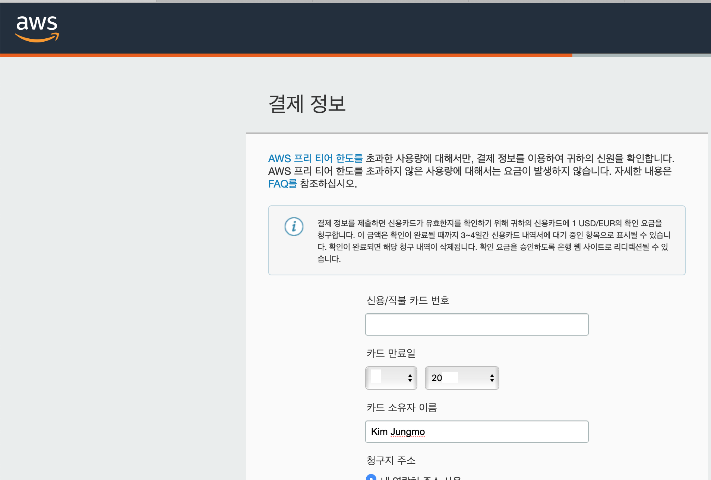
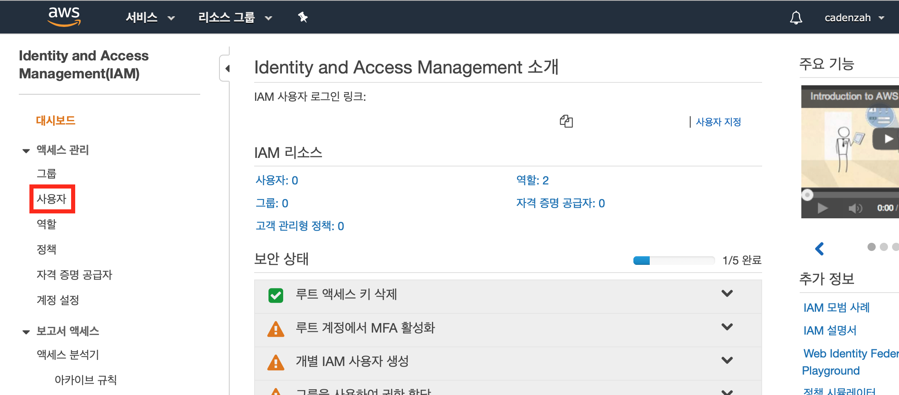
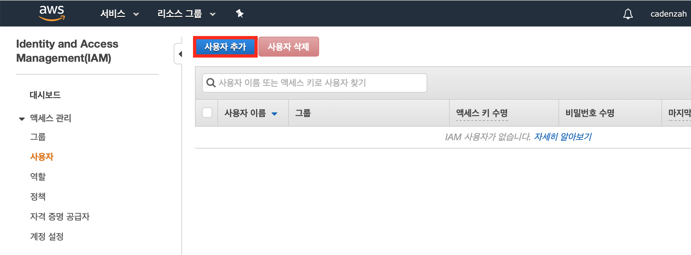
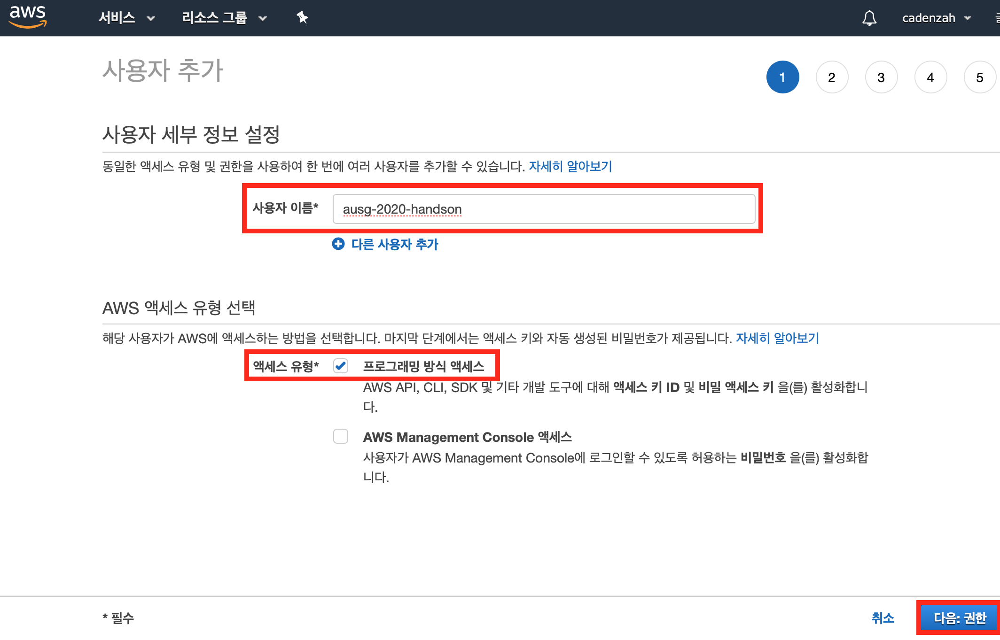
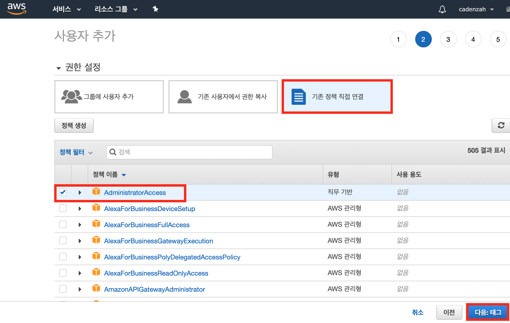
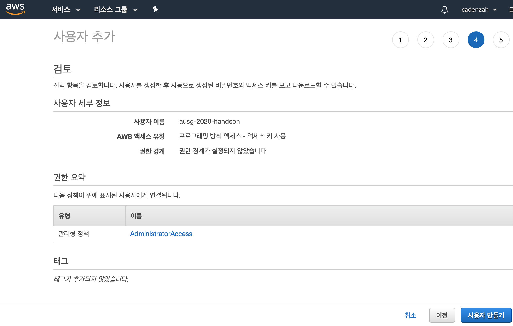
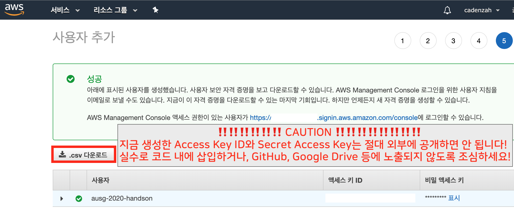
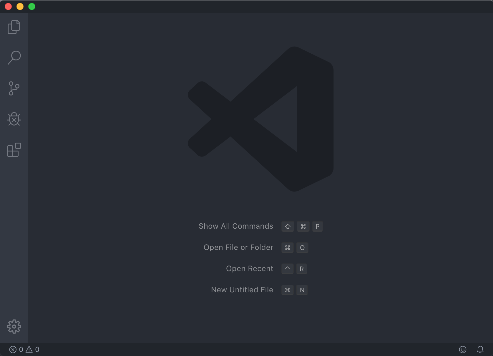
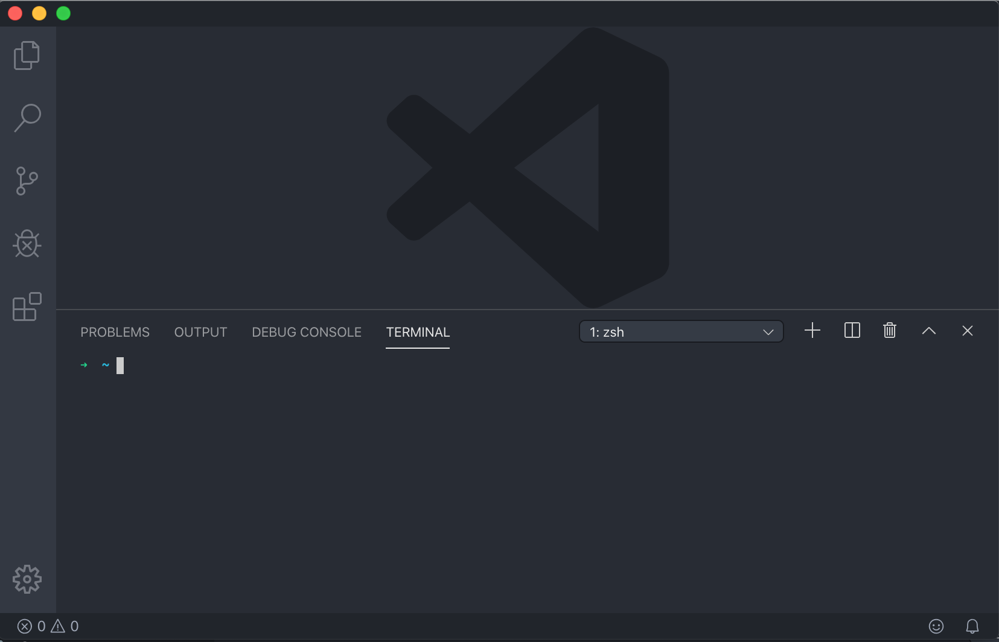

# 2. 환경 설정

이번 실습을 진행하는 데에 필요한 사전 준비 사항들을 설정합니다.

## 1. AWS 계정 생성
AWS에서 제공하는 자원을 사용하려면 AWS 서비스에 가입하여야 합니다. 아직 회원이 아니시라면, [회원가입](https://portal.aws.amazon.com/billing/signup#/start)을 해주세요.

회원가입에는 Visa 또는 Master 해외 결제가 가능한 신용카드가 필요합니다. 회원가입 과정에서 올바른 카드 정보인지 확인하지 위하여 1달러가 결제됩니다. 이는 자동으로 취소되므로 걱정하지 않으셔도 됩니다.



요청하는 정보를 순차적으로 입력하며 계속 진행하시다가, 마지막으로 기본 플랜을 선택한 뒤, 이메일 인증을 마치면 회원 가입이 완료됩니다.

새로 가입한 AWS 계정에는 AWS 서비스를 일정량 무료로 사용할 수 있는 [프리 티어(Free-Tier)](https://aws.amazon.com/ko/free/?all-free-tier.sort-by=item.additionalFields.SortRank&all-free-tier.sort-order=asc)가 제공됩니다. 이번 실습에서 필요한 AWS 서비스들은 AWS 프리 티어를 사용한다면 과금이 되지 않습니다. 만약 프리 티어의 사용 범위를 초과한다면 과금이 될 수 있으므로 주의하시고, 프리 티어가 아니시라면 새로운 실습용 계정 생성을 추천합니다.

## 2. IAM 사용자 생성
웹 프로젝트 등 코드 상에서 AWS Cloud의 자원에 접근하려면 IAM(Identity and Access Management)을 사용해야 합니다. IAM을 통하여 AWS Cloud 자원을 안전하게 보호할 수 있습니다.

처음 AWS 계정을 생성하면 아무런 IAM 키도 가지지 않습니다. 앞으로의 실습에서 AWS 자원에 접근하고 사용하려면 IAM 키를 생성해주어야 합니다. 여기서 생성한 IAM 키는 이후 `aws-cli`를 통하여 터미널 상에서 사용하게 됩니다. 현재 AWS 계정에서 생성한 AWS 자원을 사용하려면 IAM 키를 통한 인증을 거쳐서 자격을 얻어야 합니다.

이번 실습에서는 편의를 위하여 현재 AWS 계정의 모든 자원을 사용할 수 있는 **루트 사용자 자격 증명**을 생성합니다. 이렇게 생성한 IAM 키를 사용하면 아무런 제한 없이 해당 계정에 속한 모든 자원을 사용할 수 있습니다. 하지만 루트 사용자 자격 증명을 실제 개발 환경에서 그대로 사용하는 것은 보안적으로 안전하지 않습니다. 루트 사용자 자격 증명을 악의적인 사용자에게 탈취당할 경우, 모든 자원을 무제한으로 노출시키게 됩니다.

따라서, 해당 IAM 키는 절대로 유출시키면 안 됩니다. 이번 실습을 마치고 나면 해당 자격 증명은 삭제할 것이며, 실습 마무리에서 다시 안내하겠습니다.

> 안전한 AWS 자원 사용에 대한 자세한 사항은 [AWS 루트 계정 사용자](https://docs.aws.amazon.com/ko_kr/IAM/latest/UserGuide/id_root-user.html#id_root-user_manage_add-key) 문서와 [IAM 모범 사례](https://docs.aws.amazon.com/ko_kr/IAM/latest/UserGuide/best-practices.html#lock-away-credentials) 문서를 참고하시기 바랍니다.

### 루트 사용자 자격 증명 생성하기 

1. [AWS Management Console](https://console.aws.amazon.com)에 접속합니다.

2. 상단 바에서 [서비스]를 누르면 나타나는 메뉴의 검색 창에 `IAM`을 입력하고, 추천에 나타나는 [IAM: AWS 리소스에 대한 액세스 관리]를 선택합니다.

3. 왼쪽 대시보드에서 [사용자] 메뉴를 선택합니다.

    

4. IAM 사용자가 없음을 확인하고, [사용자 추가] 버튼을 클릭합니다.

    

5. [사용자 이름] 란에 사용자 이름을 입력하고, [AWS 액세스 유형 선택]에서 [프로그래밍 방식 액세스]를 선택합니다. 하단의 [다음:권한] 버튼을 클릭합니다.

    

6. [권한 설정]에서 [기존 정책 직접 연결] 버튼을 클릭합니다. 하단에서 `AdministratorAccess`를 선택합니다. 하단의 [다음:태그] 버튼을 클릭합니다.

    

7. 하단의 [다음:검토] 버튼을 클릭합니다.

8. 사용자 세부 정보가 앞서 설정한 값들과 일치하는지, 그리고 권한 요약에 `AdministratorAccess` 정책이 적힌 것을 확인하고, [사용자 만들기] 버튼을 클릭합니다.

    

9. IAM 자격 증명이 성공적으로 생성되었습니다. 이제 현재 개발 환경에서 해당 IAM 자격을 사용하여 AWS 자원에 접근할 수 있도록 IAM 키를 저장합니다. [.csx 다운로드] 버튼을 클릭하고, 다운로드된 `credentials.csv` 파일을 잘 보관합니다. 이 자격 증명 값은 해당 화면을 벗어난 뒤에는 다시 확인할 수 없으며, 해당 값을 잃어버릴 경우 다시 사용자 자격을 생성해야 하므로 유의하시기 바랍니다.

    


## 3. 코드 에디터
실습에서 작성할 TodoList의 코드를 다루기 위하여 코드 에디터가 필요합니다. 각자 선호하는 에디터를 설치해주세요. 발표자는 [VS Code](https://code.visualstudio.com)를 사용합니다.



## 4. Terminal Interface
실습에서 작성한 TodoList을 실행시키려면 Terminal 상에서 CLI 명령을 사용할 수 있어야 합니다. 각자의 PC 환경에 맞는 터미널 인터페이스를 설치해주세요.

> VS Code를 사용하면 에디터 내부에서 Terminal을 사용할 수 있습니다. 상단 메뉴에서 [View → Terminal] 을 선택해주세요.



## 5. `aws-cli` 설치 및 AWS 계정 프로필 구성 설정
앞으로 사용할 TodoList에서 AWS 서비스를 사용할 수 있으려면 터미널에서 `aws-cli` 명령어를 사용하여 AWS 자원에 접근할 수 있어야 합니다. 또한, AWS 자원 사용을 위한 자격 인증에 사용할 AWS 계정 정보를 `aws-cli`에 등록해야 합니다.

아래의 문서를 참고하여 `aws-cli`를 설치해주세요.

- [AWS CLI 버전 1 설치](https://docs.aws.amazon.com/ko_kr/cli/latest/userguide/install-cliv1.html)

> 현재 `aws-cli v2`는 미리보기(베타) 버전(2020년 1월 기준)으로, [프로덕션 환경에서 사용하기에는 아직 불안정하다](https://docs.aws.amazon.com/ko_kr/cli/latest/userguide/cli-chap-install.html)고 AWS에서 안내하고 있습니다. 이번 실습에서는 **AWS-CLI V1**을 사용하여 실습을 진행하겠습니다.

`aws-cli`를 설치하였으면, 터미널에서 아래의 명령어를 수행하여 정상적으로 설치되었는지 확인합니다.

```bash
# 발표자 PC 기준
$ aws --version
aws-cli/1.16.159 Python/2.7.16 Darwin/19.2.0 botocore/1.12.149
```

위와 같이, 설치된 `aws-cli`의 버전이 확인되면, 다음으로 [AWS 계정 프로필을 구성](https://docs.aws.amazon.com/ko_kr/cli/latest/userguide/cli-chap-configure.html)합니다. 여기서는 기본(Default) 프로필을 구성하고, 이 기본 프로필을 앞으로의 실습에서 계속 사용하겠습니다.

```bash
$ aws configure
AWS Access Key ID [None]: <액세스 키 ID값>
AWS Secret Access Key [None]: <비밀 액세스 키값>
Default region name [None]: ap-northeast-2
Default output format [None]: json
```

여기서 사용하는 액시스 키와 비밀 액세스 키는 앞서 IAM 자격을 생성하고 다운받은 `credential.csv`에 있는 값을 사용하면 됩니다. 여기서 `ap-northeast-2`는 서울 리전을 가리키는 리전 이름입니다.

AWS 프로필 설정이 완료되었으면, 터미널에서 아래의 명령어를 수행하여 정상적으로 설정되었는지 확인합니다.

```bash
$ aws configure list
      Name                    Value             Type    Location
      ----                    -----             ----    --------
   profile                <not set>             None    None
access_key     ****************AAAA shared-credentials-file
secret_key     ****************AAAA shared-credentials-file
    region           ap-northeast-2      config-file    ~/.aws/config
```

위와 같이 프로필 내용을 확인하였으면, 이제 Default 프로필을 사용하여 현재 AWS 계정의 모든 자원에 접근할 수 있습니다.

> 등록된 AWS 프로필 값은 다음 디렉토리에서 확인할 수 있습니다.
> - Mac OS X: `~/.aws/config`
> - Windows: `C:\Users\USERNAME\.aws\config`

## 5. Node.js 및 NPM 설치
이번 실습에서 작성하는 React 어플리케이션과 Amplify Framework는 Node.js 환경을 기반으로 작동합니다. 또한, 웹 어플리케이션의 작동을 위한 라이브러리를 설치하려면 NPM(Node Package Manager)가 반드시 필요합니다.

- [`Node.js` 및 NPM 설치하기](https://nodejs.org/en/)

---

여기까지 제대로 확인되었으면, 오늘의 실습을 진행할 준비가 모두 다 완료되었습니다. 이제 본격적으로 실습을 시작하도록 하겠습니다.

← [이전 장으로](https://github.com/cadenzah/ausg-2020-handson-appsync/blob/master/handson/01.introduction.md) | [다음 장으로](https://github.com/cadenzah/ausg-2020-handson-appsync/blob/master/handson/03.react.md) →
