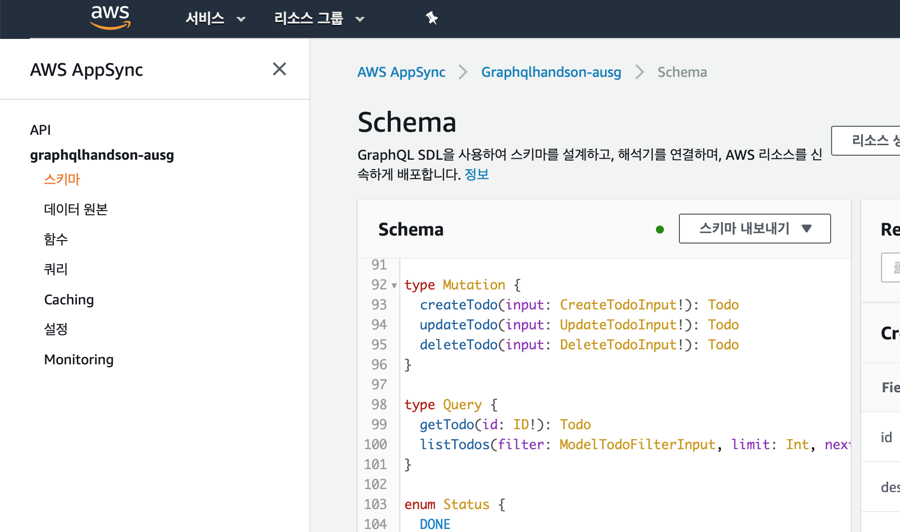

# 4. AWS Amplify 연동
데이터를 다룰 수 있는 GraphQL API 서비스를 배포하였고 정상적으로 작동하고 있습니다. 이제 이 API를 사용하여 TodoList 어플리케이션이 지속적으로 데이터를 사용할 수 있도록 연동하도록 하겠습니다.

## React 프로젝트에 API 사용을 위한 코드 추가
앞서 Amplify Framework를 연동하고 프로젝트 구성 초기화를 하면서 AWS 자원을 사용하기 위한 파일들이 자동으로 생성되었습니다. 이 파일들을 React 코드 상에서 불러와 사용할 수 있도록 코드를 추가하겠습니다.

### Amplify 설정 불러오기 및 적용 - `src/index.js`
우선, `./aws-exports`에 적힌 Amplify 관련 Credential 값을 불러와서 Amplify Framework 라이브러리를 초기화합니다. `aws-amplify`는 React 프로젝트에서 Amplify Framework를 사용할 수 있도록 AWS에서 제공하는 NPM 라이브러리 모듈입니다.

```js
// src/index.js
import Amplify from 'aws-amplify'
import config from './aws-exports'
Amplify.configure(config)

import React from 'react'
...
```

### GraphQL Query 추가 - `src/queries/`
다음으로, GraphQL API에 요청할 때에 사용할 쿼리 코드를 작성하겠습니다. 이번 실습에서 다루는 데이터는 *할 일* 단 하나로, 이 데이터에 대하여 총 4가지의 API가 필요합니다.

- Query:
  - `getTodoList`: 모든 할 일 목록 반환
- Mutation:
  - `createTodo`: 새로운 할 일 생성
  - `updateTodo`: 할 일의 상태 변경
  - `deleteTodo`: 할 일 제거

각각에 대하여 GraphQL 쿼리 코드를 작성하겠습니다. 각 쿼리 코드는 스트링 형태로 작성한 뒤, 이후 실제 API 요청시 Amplify 라이브러리의 함수에 인자로 전달하게 됩니다.

```js
// src/queries/getTodoList.js
const getTodoList = `query GetTodoList {
  listTodos {
    items {
      id
      desc
      status
      date
    }
  }
}`

export default getTodoList
```

```js
// src/queries/createTodo.js
const createTodo = `mutation CreateTodo($input: CreateTodoInput!) {
  createTodo(input: $input) {
    id
    desc
    status
    date
  }
}
`

export default createTodo
```

```js
// src/queries/updateTodo.js
const updateTodo = `mutation UpdateTodo($input: UpdateTodoInput!) {
  updateTodo(input: $input) {
    id
    status
  }
}`

export default updateTodo
```

```js
// src/queries/deleteTodo.js
const deleteTodo = `mutation DeleteTodo($input: DeleteTodoInput!) {
  deleteTodo(input: $input) {
    id
  }
}`

export default deleteTodo
```

위의 쿼리 코드에서 사용된 Query와 Mutation, 그리고 각각에 필요한 인자들은 처음 등장하여 어리둥절하셨을 것입니다. 이 값들은 이전 장에서 GraphQL API를 새롭게 생성할 때, AWS AppSync에 의하여 자동으로 생성된 값들입니다. AWS AppSync는 앞서 GraphQL API를 생성할 때에 전달받은 GraphQL Schema를 바탕으로, Schema에 정의한 데이터들을 처리하는 데에 필요한 `Type`들을 알아서 정의해줍니다. 정의된 최종 Schema는 [AWS AppSync Console](https://ap-northeast-2.console.aws.amazon.com/appsync)에서 확인할 수 있습니다.



위의 쿼리 코드를 정의할 때에 사용한 쿼리 함수들과 인자들은 AppSync가 생성한 Schema를 참고하여 작성한 것입니다. 쿼리 코드 가운데 Mutation 코드에서는 `$input` 인자를 통하여 요청에 필요한 인자들을 전달받고 있다는 점에 유의하시기 바랍니다. 여기서 전달된 인자는 AWS AppSync가 요청을 리졸브하고 데이터베이스를 조작할 때 사용됩니다.

### GraphQL API 연동 코드 추가 - `src/utils/lib/api-appsync.js`
다음으로, AWS AppSync 서비스 상에 배포된 GraphQL API를 사용하여 데이터를 다루는 함수들을 추가하겠습니다. 

기존의 코드에서 데이터는 Redux 모듈 코드 내에서 `src/utils/lib/api.js`에 정의된 함수를 실행하는 식으로 다루어집니다. `api.js`에 정의된 함수의 형식을 그대로 차용하되, GraphQL API를 사용하는 로직으로 변경하면, 기존의 Redux 코드를 크게 변경하지 않고 API와 연동할 수 있을 것입니다.

> Redux가 무엇인지 모르셔도 괜찮습니다. React 앱 실행에 필요한 값들을 저장하는 공간이라고 생각하시면 됩니다.

```js
// src/utils/lib/api-appsync.js
import { API, graphqlOperation } from 'aws-amplify'
import uuid from 'uuid/v4'

// 위에서 정의한 GraphQL 쿼리 코드들을 불러옵니다
import mutateCreateTodo from '../../queries/createTodo'
import mutateUpdateTodo from '../../queries/updateTodo'
import mutateDeleteTodo from '../../queries/deleteTodo'
import queryGetTodoList from '../../queries/getTodoList'

// 'aws-amplify' 라이브러리의 API 함수를 사용하여 graphql 요청을 보냅니다
// 1. 모든 할일 목록을 불러옵니다
const getTodoList = () => {
  return API.graphql(graphqlOperation(queryGetTodoList))
}

// 2. 새로운 할일을 생성합니다
// 이때, 생성될 할일의 정보를 객체 형태로 전달합니다
const createTodo = (desc) => {
  return API.graphql(graphqlOperation(mutateCreateTodo, {
    input: {
      id: uuid(),
      desc: desc,
      status: 'PENDING',
      date: new Date().getTime(),
    }
  }))
}

// 3. 기존의 할일을 수정합니다
// 이때, 수정될 대상 할일에 대한 정보를 `id` 속성으로 전달하고,
// 수정할 정보를 다른 속성들을 통하여 전달합니다
const updateTodo = (id, prevStatus) => {
  return API.graphql(graphqlOperation(mutateUpdateTodo, {
    input: {
      id: id,
      status: (prevStatus === 'PENDING' ? 'DONE' : 'PENDING'),
      date: new Date().getTime(),
    }
  }))
}

// 4. 기존의 할일을 제거합니다
// 제거 대상 할일은 `id` 속성으로 전달합니다
const deleteTodo = (id) => {
  return API.graphql(graphqlOperation(mutateDeleteTodo, { input: { id } }))
}

// 객체 형태로 내보냅니다
// 외부에서 이 파일을 불러오면, 객체를 다루듯이 API 호출 함수에 접근할 수 있게 됩니다
export default {
  getTodoList,
  createTodo,
  updateTodo,
  deleteTodo,
}
```

`API`와 `graphqlOperation`은 Amplify 라이브러리가 제공하는 유틸리티 함수입니다. `API`는 앞서 추가한 API 서비스의 기능을 추상화한 객체입니다. `API.graphql`을 사용하는 것으로 AWS AppSync 상에 배포된 GraphQL API의 기능을 사용하게 됩니다. `graphqlOperation`은 GraphQL 쿼리 요청을 전송하는 데에 필요한 여러 데이터들을 패키징하는 역할을 담당합니다.

각각의 함수들은 실행될 때마다 미리 정의된 GraphQL 쿼리에 따라 GraphQL API에 요청을 보내고, `Promise`의 형태로 결과값을 받아오게 됩니다.

> `Promise`가 무엇인지 모르셔도 괜찮습니다. 비동기 데이터 통신과 같이 오래 걸리는 작업의 결과를 마치 동기적인 값처럼 다룰 수 있도록 해주는 자바스크립트의 문법입니다.

### 데이터 처리 함수 교체 - `src/redux/modules/app.js`
새로운 API 함수가 완성되었으니, 이제 이 함수들을 사용하도록 기존의 코드를 수정해주어야 합니다. 기존에 사용되었던 `api.js` 대신 `api-appsync.js`를 사용하도록 코드를 수정하겠습니다.

```js
// src/redux/modules/app.js
import { createAction, handleActions } from 'redux-actions'
// import API from '../../utils/lib/api' 
import API from '../../utils/lib/api-appsync'

...
```

이제, 이름은 기존과 동일하지만 전혀 다른 기능을 하는 새로운 함수들이 React 프로젝트에서 사용됩니다.

## 잘 작동하는지 확인하기

코드를 수정한 TodoList 앱을 다시 한번 실행해보겠습니다.

```bash
$ npm run dev
```

새로 고쳐도 계속 유지되는 할 일 목록을 확인하셨다면, 제대로 진행된 것입니다.

---

여기까지 오셨다면 모든 실습을 성공적으로 진행한 것입니다. 수고하셨습니다! 이제, 실습에서 사용한 AWS 자원들을 제거 및 정리하겠습니다.

> 이 저장소의 [`complete` 브랜치](https://github.com/cadenzah/ausg-2020-handson-appsync/tree/complete)에는 실습 후 완성된 모습의 소스 코드가 저장되어있습니다. 실습을 따라오시다가 제대로 잘 진행되지 않으신다면, `complete` 브랜치를 참고하며 완성해보시기 바랍니다!

← [이전 장으로 (3/5)](https://github.com/cadenzah/ausg-2020-handson-appsync/blob/master/handson/03.react.md) | [다음 장으로 (5/5)](https://github.com/cadenzah/ausg-2020-handson-appsync/blob/master/handson/05.conclusion.md) →
